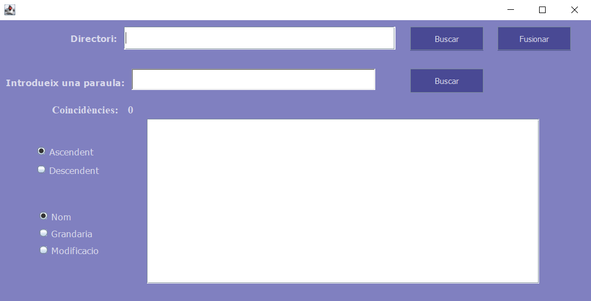

<h1 align="center">AD_AEV01</h1> 

<h2>Creado por:</h2> 
Rosa Mª Bosch Máñez

[Porfolio](https://github.com/roboma-04/Porfolio)

<h2>Descripción</h2> 

La APP consiste en una aplicación de Java con interfaz gráfica que permite gestionar archivos de texto hecho en Eclipse.

<h4>Funcionalidades</h4> 

1. **Listar archivos de texto:**
   - Permite al usuario introducir un directorio.
   - Muestra una lista de archivos de texto del directorio.

2. **Ordenar archivos:**
   - Ordena los archivos por Nombre, Tamaño y Última Modificación.
   - Proporciona opciones para ordenar de forma Ascendente y Descendente.

3. **Buscar una palabra en los archivos:**
   - Permite al usuario ingresar una palabra para buscar.
   - Muestra el número de coincidencias encontradas en todos los archivos.

4. **Fusionar archivos:**
   - Permite al usuario seleccionar dos o más archivos.
   - Solicita al usuario un nuevo nombre para el archivo fusionado.

5. **Manejo de Conflicto de Nombres:**
   - Si ya existe un archivo con el mismo nombre, muestra una ventana de confirmación.
   - Pregunta al usuario si desea sobrescribir el archivo existente.

